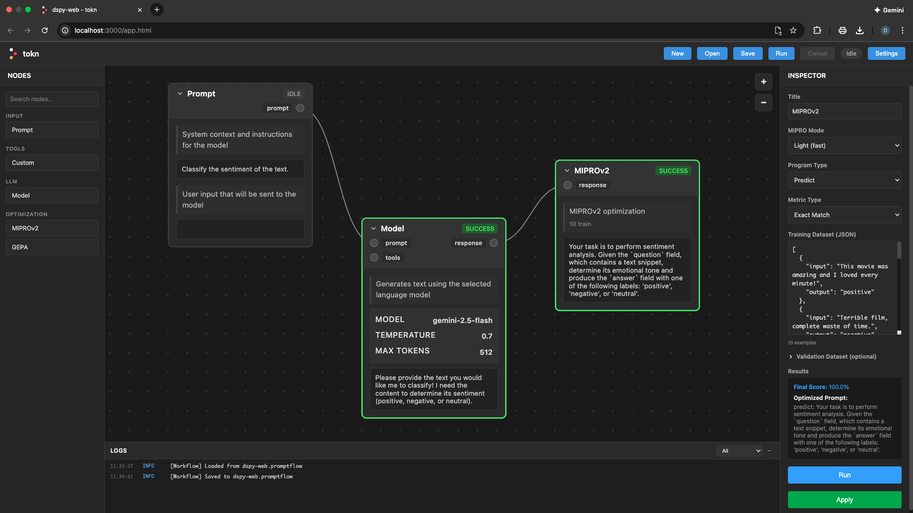

# tokn

A visual flow-based IDE for prompt engineering, testing, and optimization with Large Language Models.



## Overview

tokn is a web application that provides a node-based interface for building, testing, and optimizing prompts across multiple AI model providers. Design complex LLM workflows visually, test prompts with different models, and automatically optimize them using evolutionary algorithms.

## 🚀 Quick Start

**New to tokn?** Check out the [Quick Start Guide](QUICKSTART.md) to get running in 3 minutes!

```bash
npm install
npm run dev
# Open http://localhost:3000 and add your API keys in Settings
```

## Features

### Visual Flow Editor
- Drag-and-drop node-based canvas with pan and zoom
- Connect nodes to build multi-step LLM workflows
- Real-time execution status indicators
- Multi-node selection and manipulation

### Node Types
- **Prompt Node** - Define system and user prompts
- **Model Node** - Execute LLM inference with configurable parameters
- **Tool Node** - Create custom JavaScript tools for LLMs to call
- **DSPy Node** - Optimize prompts using the DSPy framework with automatic few-shot learning
- **MLflow Node** - Optimize prompts using evolutionary algorithms with MLflow experiment tracking

### Multi-Provider Support
- **OpenAI** - GPT-4, GPT-4o, GPT-3.5 models via API
- **Claude (Anthropic)** - Claude 3.5 Sonnet, Claude 3 Opus, Haiku models
- **Gemini (Google)** - Gemini 2.0 Flash, Gemini 1.5 Pro models
- Provider-agnostic architecture for easy extensibility

### Tool Calling System
- Define custom tools with JSON schemas
- JavaScript-based tool implementation using browser APIs
- Sandboxed execution in Web Workers (no Node.js modules)
- 30-second timeout and 5MB output limits for security
- Automatic tool registration with compatible models

### DSPy Integration
- Prompt optimization using the DSPy framework
- Automatic few-shot example selection
- Signature-based prompt compilation
- Test dataset evaluation with real-time progress tracking

### MLflow Integration
- Evolutionary prompt optimization using MLflow's GEPA library
- Multi-provider model ensemble for optimization
- Experiment tracking and metrics visualization
- Population-based search with configurable mutation and elite selection

### Workflow Management
- Save and load workflows (.toknflow files)
- Auto-save functionality with recovery
- Keyboard shortcuts (Ctrl+S, Ctrl+O, Ctrl+N)

### Security
- Encrypted API key storage using Web Crypto API (AES-GCM 256-bit)
- Keys stored in browser IndexedDB, never in plaintext
- Sandboxed tool execution in Web Workers
- Optional backend for DSPy/GEPA (API keys transmitted over HTTPS only)

## 🐳 Docker Deployment

tokn can be easily deployed using Docker and Docker Compose for both development and production environments.

### Quick Start with Docker

**Development mode (with hot reloading):**
```bash
# Frontend only (recommended for most users)
docker-compose --profile frontend up
# or: make dev-frontend

# Full stack (if using DSPy/GEPA optimization)
docker-compose --profile full up
# or: make dev

# Access the app at http://localhost:3000
```

**Production mode:**
```bash
# Frontend only
docker-compose -f docker-compose.prod.yml --profile frontend up -d
# or: make prod-frontend

# Full stack (if using optimization)
docker-compose -f docker-compose.prod.yml --profile full up -d
# or: make prod

# Access the app at http://localhost:80
```

### Services

The Docker setup includes:

- **Frontend** - React app with Vite (dev) or Nginx (prod) on port 3000/80
- **Backend** (optional) - Python Flask API for DSPy/GEPA optimization on port 5000

**Note:** Backend is only needed if you're using the DSPy or GEPA optimization features. Most users can run just the frontend!

### Documentation

- **[DOCKER.md](DOCKER.md)** - Complete Docker usage guide
- **[DOCKER_DEPLOYMENT.md](DOCKER_DEPLOYMENT.md)** - Deployment to production

## File Structure

```
tokn/
├── src/                     # React application source
│   ├── main.jsx             # React entry point
│   ├── App.jsx              # Main React component
│   ├── services/            # Core services
│   │   ├── webStorage.js    # Encrypted API key storage (Web Crypto + IndexedDB)
│   │   └── fileOperations.js # File System Access API wrapper
│   └── workers/             # Web Workers
│       └── toolWorker.js    # Sandboxed tool execution
├── renderer/                # Original application logic (transitioning)
│   ├── script.js            # Core app logic and state
│   ├── main.css             # Application styles
│   ├── model-adapters.js    # Provider-specific adapters (OpenAI, Claude, Gemini)
│   ├── dspy-worker.js       # DSPy backend API client
│   ├── gepa-worker.js       # GEPA backend API client
│   ├── tool-script.js       # Tool node implementation
│   └── tool-worker-launcher.js # Web Worker launcher
├── backend/                 # Python Flask API (optional)
│   ├── app.py               # Flask server
│   ├── routes/              # API endpoints
│   │   ├── dspy_route.py    # DSPy optimization endpoint
│   │   └── gepa_route.py    # GEPA optimization endpoint
│   ├── dspy/                # DSPy Python scripts
│   └── gepa/                # GEPA Python scripts
├── services/                # Business logic
│   ├── providerRegistry.js  # Provider management
│   └── config.js            # Configuration
├── docs/                    # Documentation
│   ├── BACKEND_API.md       # Backend API documentation
│   └── DEPLOYMENT.md        # Deployment guide
├── index.html               # Vite entry point
├── vite.config.js           # Vite configuration
└── package.json             # Dependencies and metadata
```

### Usage

1. **Create a Workflow**
   - Add nodes from the top toolbar
   - Connect nodes by dragging from output to input ports
   - Configure nodes using the inspector panel

2. **Run a Prompt**
   - Connect a Prompt node to a Model node
   - Set your prompt text and model parameters
   - Click "Run Flow" to execute

3. **Optimize Prompts with DSPy**
   - Add a DSPy node
   - Define test cases and input/output signatures
   - Configure optimization parameters
   - Run to automatically improve your prompt with few-shot learning

4. **Optimize Prompts with MLflow**
   - Add an MLflow GEPA node
   - Define test cases with expected outputs
   - Configure evolutionary algorithm parameters (population size, generations, mutation rate)
   - Run to optimize your prompt using population-based search with MLflow tracking

## Use Cases

- Iterative prompt refinement with visual feedback
- Model comparison across providers
- Complex multi-step LLM workflows
- Tool development and testing for LLM function calling
- Automated prompt optimization
