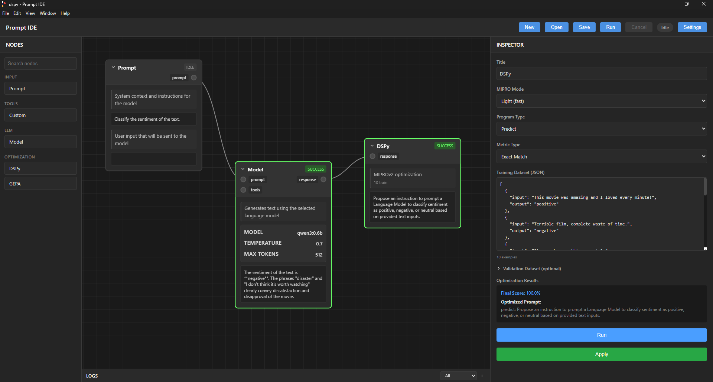

# tokn

A visual flow-based IDE for prompt engineering, testing, and optimization with Large Language Models.



## Overview

tokn is a cross-platform desktop application that provides a node-based interface for building, testing, and optimizing prompts across multiple AI model providers. Design complex LLM workflows visually, test prompts with different models, and automatically optimize them using evolutionary algorithms.

## Features

### Visual Flow Editor
- Drag-and-drop node-based canvas with pan and zoom
- Connect nodes to build multi-step LLM workflows
- Real-time execution status indicators
- Multi-node selection and manipulation

### Node Types
- **Prompt Node** - Define system and user prompts
- **Model Node** - Execute LLM inference with configurable parameters
- **Tool Node** - Create custom JavaScript tools for LLMs to call
- **DSPy Node** - Optimize prompts using the DSPy framework with automatic few-shot learning

### Multi-Provider Support
- **Ollama** - Run local models (default: localhost:11434)
- **OpenAI** - Access GPT models via API
- Provider-agnostic architecture for easy extensibility

### Tool Calling System
- Define custom tools with JSON schemas
- JavaScript-based tool implementation
- Sandboxed execution in web workers
- Automatic tool registration with compatible models

### DSPy Integration
- Prompt optimization using the DSPy framework
- Automatic few-shot example selection
- Signature-based prompt compilation
- Test dataset evaluation with real-time progress tracking

### Workflow Management
- Save and load workflows (.promptflow files)
- Auto-save functionality with recovery
- Keyboard shortcuts (Ctrl+S, Ctrl+O, Ctrl+N)

### Security
- Encrypted API key storage using Electron's safeStorage
- Sandboxed tool execution
- No credentials stored in plaintext

## File Structure

```
tokn/
├── main/                    # Electron main process
│   ├── index.js             # Window creation, IPC handlers
│   ├── preload.js           # Security preload script
│   └── secureStorage.js     # Encrypted credential storage
├── renderer/                # UI and application logic
│   ├── index.html           # Main UI structure
│   ├── main.css             # Application styles
│   ├── script.js            # Core app logic and state
│   ├── model-adapters.js    # Provider-specific adapters
│   ├── dspy-script.js       # DSPy optimization logic
│   ├── tool-script.js       # Tool node implementation
│   └── tool-worker.js       # Sandboxed tool execution
├── services/                # Business logic
│   ├── modelService.js      # Model API interactions
│   ├── providerRegistry.js  # Provider management
│   └── config.js            # Configuration
└── package.json             # Dependencies and metadata
```

### Usage

1. **Create a Workflow**
   - Add nodes from the top toolbar
   - Connect nodes by dragging from output to input ports
   - Configure nodes using the inspector panel

2. **Run a Prompt**
   - Connect a Prompt node to a Model node
   - Set your prompt text and model parameters
   - Click "Run Flow" to execute

3. **Optimize Prompts**
   - Add a DSPy node
   - Define test cases and input/output signatures
   - Configure optimization parameters
   - Run to automatically improve your prompt with few-shot learning

## Use Cases

- Iterative prompt refinement with visual feedback
- Model comparison across providers
- Complex multi-step LLM workflows
- Tool development and testing for LLM function calling
- Automated prompt optimization
